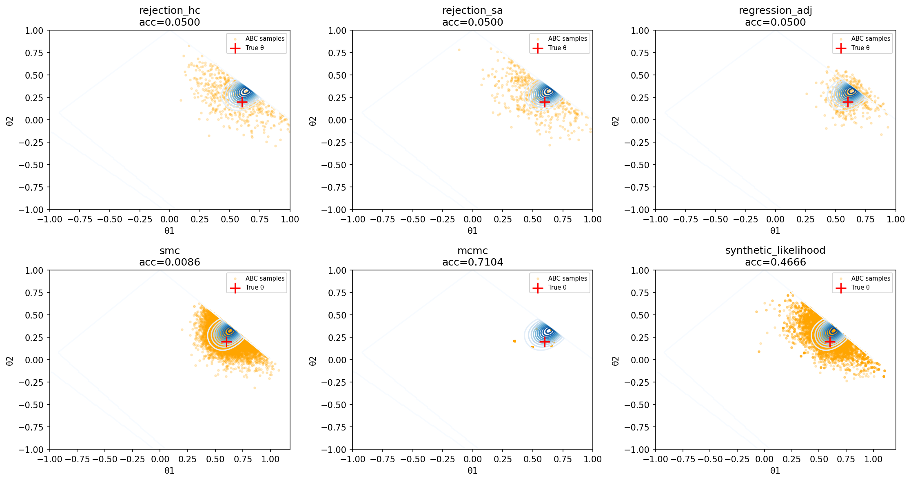
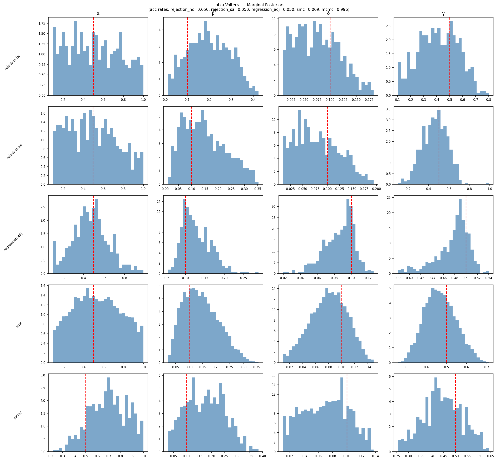

# abclib

abclib is a from-scratch Python library for likelihood-free Bayesian inference, built as an independent study project extending coursework in simulation and Bayesian statistics. It implements rejection ABC, SMC-ABC, MCMC-ABC, synthetic likelihood, and semi-automatic summary statistics, with a full validation suite (SBC, PPC, STR) applied to an MA(2) model and a stochastic Lotka-Volterra predator-prey system. [Read the full report (PDF)](docs/report.pdf)

---

## Installation

```bash
pip install -e ".[dev]"
```

**Requirements:** Python ≥ 3.8, NumPy ≥ 1.24, SciPy ≥ 1.10, Matplotlib ≥ 3.7.

---

## Background

Bayesian inference requires evaluating the likelihood $f(y\mid\theta)$, which is analytically intractable for many models of practical interest. ABC replaces likelihood evaluation with simulation-based comparison: rather than computing $f(y_{obs}\mid\theta)$ directly, it asks whether data simulated under $\theta$ resembles the observed data.

The ABC posterior is:

$$\pi_{ABC}(\theta\mid y_{obs})\propto \pi_0(\theta)\cdot\mathbf{1}[d(S(y_{sim}),S(y_{obs}))\le\varepsilon]$$

where $S(\cdot)$ is a summary statistic function, $d(\cdot,\,\cdot)$ is a distance function, and $\varepsilon$ is a tolerance threshold. As $\varepsilon\rightarrow0$ and $S(\cdot)$ is sufficient for $\theta$, the ABC posterior converges to the true posterior.

---

## Quick Start

The minimal workflow is: define a prior and simulator, fit summary statistics on pilot simulations, then run a sampler.

```python
import numpy as np
from abclib import RejectionABC, HandCraftedSummary
from abclib.distance import euclidean
from abclib.utils import run_pilot

# 1. Define prior and simulator
def prior():
    return np.random.uniform(-1, 1, size=2)

def simulator(theta):
    # ... your model here
    return data

# 2. Define summary functions
functions = {
    "mean": np.mean,
    "variance": np.var,
}

# 3. Fit summary statistics on pilot simulations
stat = HandCraftedSummary(functions)
pilot_thetas, pilot_sims = run_pilot(prior, simulator, n_pilot=1000)
stat.fit(pilot_thetas, pilot_sims)

# 4. Compute observed summaries
s_obs = stat.transform(observed_data)

# 5. Run rejection ABC
sampler = RejectionABC(prior, simulator, stat, euclidean)
result = sampler.sample(s_obs, n_simulations=10_000, q=0.05)

print(result.posterior_mean())
print(result.credible_interval(alpha=0.90))
```

---

## Library Structure

### Summary Statistics

All summary statistics follow a `fit` / `transform` interface.

**`HandCraftedSummary(functions)`**

Takes a dictionary of named callables. Each callable accepts a single simulated dataset and returns a scalar. During `fit`, the prior-predictive standard deviation of each statistic is computed and used to normalise `transform` output, ensuring no statistic dominates the distance purely by scale.

```python
from abclib import HandCraftedSummary

functions = {
    "autocorr_lag1": lambda y: float(np.corrcoef(y[:-1], y[1:])[0, 1]),
    "autocorr_lag2": lambda y: float(np.corrcoef(y[:-2], y[2:])[0, 1]),
}

stat = HandCraftedSummary(functions)
stat.fit(pilot_thetas, pilot_sims)
s = stat.transform(y_obs)  # shape (2,)
```

**`SemiAutomaticSummary(h)`**

Learns optimal linear summary statistics from a pilot regression (Fearnhead & Prangle, 2012). Takes a candidate transformation `h(y)` and fits one OLS regression per parameter, producing a summary vector of dimension equal to the number of parameters.

```python
from abclib import SemiAutomaticSummary

def h(y):
    return np.array([np.mean(y), np.var(y), np.corrcoef(y[:-1], y[1:])[0, 1]])

stat = SemiAutomaticSummary(h)
stat.fit(pilot_thetas, pilot_sims)
s = stat.transform(y_obs)  # shape (n_params,)
```

Both classes raise `RuntimeError` if `transform` is called before `fit`. The `BaseSampler` constructor enforces that a fitted statistic is passed to samplers.

---

### Samplers

All samplers inherit from `BaseSampler` and return an `ABCResult` containing `.samples`, `.distances`, `.summaries`, `.epsilon`, `.n_simulations`, `.acceptance_rate`, `.posterior_mean()`, and `.credible_interval()`.

**`RejectionABC`** — baseline sampler. Draws `n_simulations` proposals from the prior and accepts those within the `q`-quantile of all distances.

```python
from abclib import RejectionABC
from abclib.distance import euclidean

sampler = RejectionABC(prior, simulator, stat, euclidean)
result = sampler.sample(s_obs, n_simulations=10_000, q=0.05)
```

**`SMCABC`** — Sequential Monte Carlo. Evolves `M` particles through `T` stages of decreasing tolerances, concentrating simulation effort near the posterior. Requires a vectorised `prior_density` callable for importance weight computation.

```python
from abclib import SMCABC

def prior_density(thetas):  # shape (n, n_params) -> shape (n,)
    ...

sampler = SMCABC(prior, simulator, stat, euclidean,
                prior_density=prior_density)
result = sampler.sample(s_obs, M=1000, T=5, q=0.50)
# result.epsilons contains the full tolerance sequence
```

**`MCMCABC`** — Markov Chain Monte Carlo. Runs a Metropolis-Hastings chain targeting the ABC posterior, using an ε-gate as a pre-filter. Requires a scalar `prior_pdf` callable.

```python
from abclib import MCMCABC

def prior_pdf(theta):  # scalar density
    ...

sampler = MCMCABC(prior, simulator, stat, euclidean,
                  prior_pdf=prior_pdf, proposal_std=0.1)
result = sampler.sample(s_obs, n_samples=10_000, epsilon=0.05)
```

**Distance functions** — `abclib.distance` provides `euclidean` and `mahalanobis`. Euclidean is appropriate when statistics have been normalised (as `HandCraftedSummary` does by default). Mahalanobis accounts for correlation but requires a covariance matrix estimated from pilot simulations.

---

### Post-Processing

**`RegressionAdjustment`** — reduces tolerance-induced bias in rejection ABC at no additional simulation cost. Fits a local linear regression of accepted parameters on the deviation of their summaries from `s_obs`, then shifts each accepted draw towards the value it would have taken had its summaries exactly matched `s_obs`. Out-of-bounds samples are reflected back into the prior support.

```python
from abclib import RegressionAdjustment

adj = RegressionAdjustment(prior_bounds=[(-1, 1), (-1, 1)])
adj.fit(result, s_obs)
adjusted_result = adj.adjust(result, s_obs)
```

**Note:** The linear correction is only valid when the summary-to-parameter relationship is approximately linear near the posterior mode. Always validate the correction using SBC after applying it.

---

### Synthetic Likelihood

**`SyntheticLikelihood`** — replaces the intractable likelihood with a Gaussian approximation (Wood, 2010; Price et al., 2018). At each MCMC step, `M` simulations are run at the proposed parameter to estimate the mean and covariance of the summary statistics, which are then used to evaluate the Gaussian log-density at `s_obs`. The MH acceptance ratio is computed entirely in log space for numerical stability.

```python
from abclib import SyntheticLikelihood

sl = SyntheticLikelihood(prior, simulator, stat,
                         prior_pdf=prior_pdf, proposal_std=0.1)
result = sl.sample(s_obs, n_simulations=10_000, M=100)
# Returns SLResult with .samples, .log_likelihoods, .acceptance_rate
```

---

### Validation Diagnostics

Three complementary diagnostics are provided. A method that passes all three gives substantially stronger guarantees than one that passes any single check.

**`run_sbc`** — Simulation-Based Calibration (Talts et al., 2020). Tests global calibration by checking whether the rank of the true parameter within its posterior sample is uniformly distributed. Returns rank histograms and KS test p-values per parameter.

```python
from abclib import run_sbc, plot_rank_histogram

sbc = run_sbc(sampler, simulator, prior,
              n_trials=500, L=100,
              summary_statistic=stat,
              n_simulations=10_000, q=0.05)

# sbc["ks_pvalue"] — p-values per parameter (< 0.05 indicates miscalibration)
plot_rank_histogram(sbc, output_dir="plots", parameter_names=["θ1", "θ2"])
```

**`run_ppc`** — Posterior Predictive Checks. Checks whether the model can reproduce specific features of the observed data under the approximate posterior.

```python
from abclib import run_ppc

ppc = run_ppc(result, simulator, y_obs,
              test_statistic=np.mean, n_samples=1000)
# ppc["p_value"] — near 0 or 1 indicates model misfit for this statistic
```

**`run_str`** — Synthetic Truth Recovery. Checks instance-level recovery across a grid of parameter values spanning the prior support, exposing region-specific failures that SBC averages over.

```python
from abclib import run_str, plot_str_results

theta_grid = np.array([[0.3, 0.1], [0.6, 0.2], [-0.3, 0.1]])
str_result = run_str(sampler, simulator, theta_grid, stat,
                     credible_mass=0.90, n_simulations=10_000, q=0.05)

# str_result["coverage"] — empirical coverage per parameter
plot_str_results(str_result, output_dir="plots", parameter_names=["θ1", "θ2"])
```

---

## Examples

Two fully worked examples are provided under `examples/`, each implementing the `Model` base class and using the `run_validation` pipeline.

**MA(2)** (`examples/ma2/`) — A second-order moving average model with a tractable exact posterior, used to validate every method before application to the intractable case study. The exact posterior is available in closed form, allowing direct comparison with ABC posteriors.



*Marginal posteriors from each method on the stochastic Lotka-Volterra model. 
True parameters marked in red. Rejection ABC (HC and SA) use N=10,000 
simulations at q=0.05. Regression adjustment is applied to the rejection ABC (HC) result. SMC-ABC uses M=10,000 particles over T=5 stages. MCMC-ABC runs a chain of 10,000 steps at $\varepsilon$=0.05. Synthetic likelihood uses N=10,000 steps with M=100 replicates per step.*

```bash
python -m examples.ma2.validation
```

**Lotka-Volterra** (`examples/lotka_volterra/`) — A stochastic predator-prey model with lognormal observation noise layered over Euler-Maruyama ODE dynamics. The likelihood is doubly intractable: the stochastic transition density has no closed form, and the observation noise requires integrating over the latent trajectory.



*Marginal posteriors from each method on the stochastic Lotka-Volterra model. 
True parameters marked in red. Rejection ABC (HC and SA) use N=10,000 
simulations at q=0.05. Regression adjustment is applied to the rejection ABC (HC) result. SMC-ABC uses M=10,000 particles over T=5 stages. MCMC-ABC runs a chain of 10,000 steps at $\varepsilon$=1.0. Synthetic likelihood uses N=2,000 steps with M=200 replicates per step.*

```bash
python -m examples.lotka_volterra.validation
```

Both scripts run the full pipeline — pilot fitting, all inference methods, posterior comparison plots, SBC, PPC, and STR — and save results to the example directory.

### Implementing your own model

Subclass `examples.model.Model` and implement the required interface:

```python
from examples.model import Model
import numpy as np

class MyModel(Model):
    def __init__(self):
        super().__init__(name="My Model")

    @property
    def parameter_names(self):
        return ["θ1", "θ2"]

    @property
    def prior_bounds(self):
        return [(-1, 1), (-1, 1)]

    def prior(self):
        return np.random.uniform(-1, 1, size=2)

    def prior_pdf(self, theta):
        if np.all(np.abs(theta) <= 1):
            return 0.25
        return 0.0

    def prior_density(self, thetas):
        return np.array([self.prior_pdf(t) for t in thetas])

    def simulator(self, theta):
        # ... your simulator
        return data

    @property
    def SUMMARY_FUNCTIONS(self):
        return {"mean": np.mean, "var": np.var}

    def H_FUNCTION(self, y):
        return np.array([np.mean(y), np.var(y)])
```

Then pass it to `run_validation` with a `Config`:

```python
from examples.validation import run_validation
from examples.config import Config

result = run_validation(
    model=MyModel(),
    config=Config(methods=["all"]),
    true_theta=np.array([0.3, 0.1]),
    observed_data=observed_data
)
```

---

## Running the Tests

```bash
pytest tests/
```

To skip slow tests (SBC runs requiring many sampler calls):

```bash
pytest tests/ -m "not slow"
```